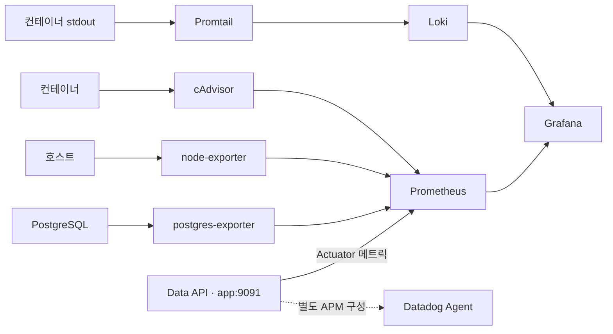

# Observability

> 요청이 느려진 이유를 트래픽·DB·리소스·로그에서 함께 찾는 GROMO 관측 설정입니다.

[서버 전체 보기](../README.md) · [실행·배포 도구](../scripts/README.md) · [Datadog 상세](datadog/README.md) · [부하 테스트](../../loadtest/README.md)

## 1. 수집 구조



현재 [Prometheus 설정](prometheus/prometheus.yml)은 `app:9091`과 PostgreSQL·호스트·컨테이너를 수집합니다. Business·Notification·Realtime에도 관리 포트가 있지만 이 설정에 자동 등록되지는 않습니다. 신규 서비스를 관측하려면 scrape 대상과 대시보드를 추가해야 합니다.

## 2. 무엇을 확인하나

| 확인할 문제 | 함께 볼 신호 |
| --- | --- |
| API가 느려짐 | 요청량, p95·p99, 5xx, HikariCP pending |
| DB 연결이 부족함 | active·idle·pending, DB 활성 연결과 처리량 |
| 쿼리 비용이 커짐 | DB 캐시히트, 디스크 읽기, 필요 시 느린 쿼리 |
| 프로세스가 바빠짐 | 호스트·컨테이너 CPU와 메모리 |
| 오류가 반복됨 | ERROR 발생률, Loki 실시간 로그, 선택적 APM |

이 지표는 병목을 좁히는 단서입니다. 성능 수치는 [부하 테스트](../../loadtest/README.md)의 시나리오·실행 조건과 함께 해석합니다.

## 3. 설정 파일 지도

| 위치 | 역할 |
| --- | --- |
| [prometheus/](prometheus/) | 수집 대상과 주기 |
| [grafana/dashboards/](grafana/dashboards/) | 대시보드 JSON |
| [grafana/provisioning/](grafana/provisioning/) | 데이터소스·대시보드 자동 등록 |
| [loki/](loki/) · [promtail/](promtail/) | 로그 저장·수집 |
| [datadog/](datadog/) | APM·OpenMetrics 연동 안내 |

## 4. dev 실행과 운영

dev 서버의 **로그·트래픽·쿼리 부하를 한 화면에서 실시간** 확인. Prometheus + Grafana + Loki 셀프호스트를
docker-compose overlay 로 기존 dev 스택 위에 얹는다. 무료(컨테이너 비용뿐). 수집층은 GROMO-588(Actuator+micrometer).

## 실행

기존 `docker-compose.dev.yml`(app·db) **위에 overlay**로 올린다:

```bash
# 저장소 루트에서 실행
# --env-file 은 dev-cd 가 checkout 밖에 만든 runtime env (POSTGRES_*, GRAFANA_ADMIN_PASSWORD 등
# — dev-monitor.yml 이 쓰는 것과 동일). 빼면 빈 값으로 치환돼 db 재생성·기동 실패 위험.
docker compose --env-file ../.gromo-runtime/dev.env \
  -f server/scripts/docker-compose.dev.yml -f server/scripts/docker-compose.observability.yml up -d
```

- Grafana: `http://<서버>:3000` (admin / `$GRAFANA_ADMIN_PASSWORD`)
- 대시보드: **"GROMO — dev 관측"** (자동 프로비저닝, 5초 새로고침)
  - ※ 대시보드는 **as-code** — Grafana UI 에서 패널을 즉석 수정해도 ~10초 내 파일 버전으로 되돌아간다. 영구 변경은 `server/observability/grafana/dashboards/gromo-overview.json` 을 직접 수정.

관측 컨테이너만 중지:

```bash
docker compose --env-file ../.gromo-runtime/dev.env \
  -f server/scripts/docker-compose.dev.yml -f server/scripts/docker-compose.observability.yml \
  stop prometheus grafana loki promtail postgres-exporter node-exporter cadvisor
```

> `down`은 병합된 기본 앱·DB까지 종료하므로 관측만 중지할 때는 위 `stop`을 사용합니다.

> ⚠️ 반드시 `-f` 두 개로 실행. 그래야 dev 의 `app-network`·`app`·`db` 와 같은 프로젝트/네트워크를 공유해
> `app:9091`·`db:5432` 를 서비스명으로 스크레이프한다. `dev-cd.yml` 은 `up -d app` 만 하므로 배포와 간섭 없음.

## 한 화면 구성

| 구역 | 패널 | 소스 |
|---|---|---|
| **트래픽 (RED)** | 요청수 · p95/p99 · 5xx율 · 상태코드별 | micrometer `http.server.requests` |
| **쿼리 부하** | HikariCP active/idle/**pending**(L1) · DB tps · 캐시히트 · 활성커넥션(L2) | actuator HikariCP + postgres-exporter |
| **리소스** | CPU · 메모리 | node-exporter |
| **로그 (실시간)** | ERROR 발생률 + 앱 로그 라이브 테일 | promtail(docker_sd) → Loki |

**부하 해석**: HikariCP `pending`↑ & DB tps 낮음 → 앱–DB 큐잉(커넥션 부족·느린 쿼리 점유).
DB 캐시히트↓(`blks_read`↑) → 인덱스/쿼리 문제. 두 지표의 교차가 병목 위치를 가리킨다.

## 스크레이프 대상 / 포트

- `app:9091/actuator/prometheus` — 트래픽·HikariCP (dev 내부 관리 포트, GROMO-588)
- `postgres-exporter:9187` — PostgreSQL 지표 · `node-exporter:9100` · `cadvisor`(내부)
- 외부 노출: Grafana `:3000` / 내부: Prometheus `:9090`(127.0.0.1)·Loki `:3100`

## 보안 메모

- `/actuator/*` 는 무인증(JwtFilter 는 `/api/*` 만 필터). dev 는 관리 포트 **9091 을 호스트 미공개**로 두어
  `app-network` 안 Prometheus 만 접근 → 공개 8080 으로 메트릭이 새지 않음.
- **Grafana 3000 은 외부 노출** — 방화벽/보안그룹으로 접근 제한 + `GRAFANA_ADMIN_PASSWORD` 변경 필수.
- promtail 이 `docker.sock`(ro) 마운트 — 호스트 컨테이너 로그 접근용. 신뢰 경계 확인.

## 쿼리 부하 L3 (옵션 — 느린 쿼리 Top N)

기본은 L1·L2 로 "부하"를 본다. "어느 쿼리가 느린가"까지 필요하면:

1. `pg_stat_statements` 활성 — `docker-compose.dev.yml` 의 `db.command` 에
   `-c shared_preload_libraries=pg_stat_statements` 추가 후 재시작 → `CREATE EXTENSION pg_stat_statements;`.
2. postgres-exporter 커스텀 쿼리로 상위 N 노출, 또는
3. dev p6spy 로그 on(`application-dev.yml` `decorator.datasource.p6spy.enable-logging: true`) → 개별 쿼리를 Loki 에서 검색.

## 로컬(비-dev)에서 볼 때

app 을 호스트에서 `bootRun` 으로 띄우면, `server/observability/prometheus/prometheus.yml` 의 타깃 `app:9091` 을
`host.docker.internal:9091` 로 바꾸고 app 을 관리 포트가 설정된 프로파일(dev)로 실행한다.

관련: GROMO-588(수집층) · GROMO-589(알람·uptime·Terraform).
