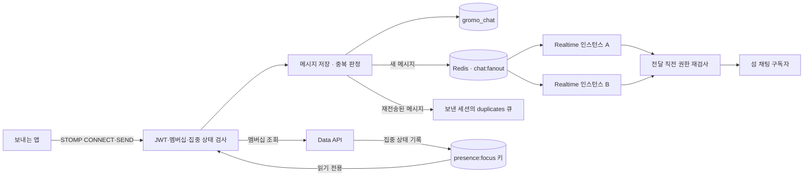

# Realtime

> 같은 섬의 주민이 대화하고 읽은 위치를 이어가는 실시간 서버입니다.

[서버 전체 보기](../README.md) · [채팅 DB 스키마](docs/db/schema.dbml) · [실시간 이벤트 설계](../../docs/prd/realtime-events/high-level-design.md)

## 1. 역할과 구현 범위

Realtime은 WebSocket/STOMP 채팅, 메시지 이력, 읽음 위치와 Redis를 통한 다중 인스턴스 전파를 담당합니다. Data API와 코드를 공유하지 않는 Java 17·Spring Boot 4.0.6 독립 프로젝트이며, 채팅 데이터는 별도 `gromo_chat` DB에 보관합니다.

**현재 사용할 수 있는 주 도메인은 채팅입니다.** `/ws/realtime` 연결 경로와 신규 이벤트 라우터 기반은 있지만, 새 섬 이벤트 채널은 인가·스냅샷·권한 회수 구현이 준비되기 전까지 닫혀 있습니다. `DisabledRealtimeDelivery`는 새 이벤트 전달을 거절합니다.

## 2. 채팅 전달 구조



인메모리 SimpleBroker는 자신의 JVM에 연결된 구독자만 압니다. Redis Pub/Sub가 인스턴스 간 전달을 맡고, 각 인스턴스는 실제 소켓으로 내보내기 직전에도 JWT·멤버십·집중 상태를 검사합니다.

## 3. 채팅 계약

| 구분 | 경로 | 의미 |
| --- | --- | --- |
| WebSocket | `/ws/chat`, `/ws/realtime` | STOMP 연결, CONNECT 프레임에서 인증 |
| SEND | `/app/groups/{groupId}/send` | 메시지 전송 |
| SUBSCRIBE | `/topic/groups/{groupId}` | 해당 섬의 채팅 수신 |
| SUBSCRIBE | `/user/queue/errors` | 전송 오류 |
| SUBSCRIBE | `/user/queue/duplicates` | 재전송한 메시지의 원 결과 |
| GET | `/api/v1/chat/rooms` | 내 채팅방과 읽지 않은 개수 |
| GET | `/api/v1/chat/rooms/{groupId}/messages?cursor&size` | 최신순 메시지 이력 |
| POST | `/api/v1/chat/rooms/{groupId}/read` | 읽음 위치를 앞으로 이동 |

### 집중 중에는 연결과 채팅 권한을 구분합니다

CONNECT는 JWT 인증을 담당합니다. 집중 중에도 연결은 유지할 수 있지만 채팅 구독·발신·REST 접근과 기존 구독에 대한 본문 전달은 제한합니다. 채팅에서 푸시를 발송하지는 않습니다.

### 재전송과 재연결을 구분합니다

`clientMessageId`로 중복 저장을 막습니다. 재전송은 원 메시지를 보낸 세션의 `/user/queue/duplicates`로 돌려주며 방 전체에 다시 방송하지 않습니다. Redis Pub/Sub는 메시지 이력 저장소가 아니므로 재연결 후에는 REST 이력 조회로 보완합니다.

## 4. 데이터 소유권과 현재 제약

| 자원 | 소유 · 사용 |
| --- | --- |
| `gromo_chat` | Realtime의 메시지·읽음 위치, Flyway 관리 |
| `cache:chat:member:{userId}` | Realtime이 관리하는 멤버십 캐시 |
| `chat:fanout` | Realtime의 인스턴스 간 Pub/Sub |
| `presence:focus:{userId}` | Data가 쓰고 Realtime이 읽는 집중 상태 |

- 현재 멤버십 조회는 요청자의 AT로 Data의 `GET /api/v1/groups`를 호출합니다. 신규 내부 인가 계약으로의 전환은 별도 작업입니다.
- 멤버십 캐시 기본 TTL은 120초입니다. 탈퇴·강퇴 반영은 캐시 만료까지 지연될 수 있습니다.
- dev overlay의 Redis에는 서비스별 ACL이 적용되지 않았습니다. presence 읽기 전용은 현재 코드 규칙이며, 배포 권한으로 강제되는 상태와 구분해야 합니다.
- Redis는 Realtime의 필수 의존성입니다. readiness에 DB·Redis를 포함합니다.

## 5. 실행 · 검증

### 통합 테스트

Java 17과 Docker를 준비합니다. 테스트는 PostgreSQL·Redis 컨테이너를 사용하고, `ci`에서도 Flyway와 Hibernate `validate`로 스키마를 검증합니다.

```bash
cd server/realtime
./gradlew test
./gradlew build
```

### 개발 실행

전용 DB와 Redis를 준비하고 아래 환경변수를 주입합니다. Data와 `JWT_SECRET`이 같아야 합니다.

| 설정 | 용도 |
| --- | --- |
| `CHAT_DB_URL`, `CHAT_DB_USERNAME`, `CHAT_DB_PASSWORD` | 별도 채팅 DB |
| `REDIS_HOST`, `REDIS_PORT` | Redis 연결, 포트 기본값 6379 |
| `JWT_SECRET` | Data가 발급한 AT 서명 검증 |
| `DATA_API_BASE_URL` | 멤버십 조회 상류 |
| `CHAT_WS_ALLOWED_ORIGINS` | 웹 클라이언트의 허용 Origin |

```bash
# server/realtime 기준, 위 환경변수 주입 후
./gradlew bootRun --args='--spring.profiles.active=dev'
```

기본 포트는 `8081`, 내부 관리 포트는 `9091`입니다. 개발 서버의 [Realtime overlay](../scripts/docker-compose.realtime.yml)는 기존 dev Compose 위에서 `realtime-db-init`으로 DB를 준비합니다. **dev 전용**이며 prod에 그대로 적용할 수 없습니다. 자세한 조합은 [Scripts](../scripts/README.md)를 참고합니다.

## 6. 코드 탐색

[`com.oneorthree.realtime`](src/main/java/com/oneorthree/realtime)의 `message/`는 채팅 저장·조회, `membership/`은 섬 권한, `presence/`는 집중 상태 조회, `fanout/`은 Redis 전파, `event/`는 신규 이벤트 라우팅을 담당합니다. WebSocket 인바운드·아웃바운드 보안은 `config/`에서 확인합니다.
