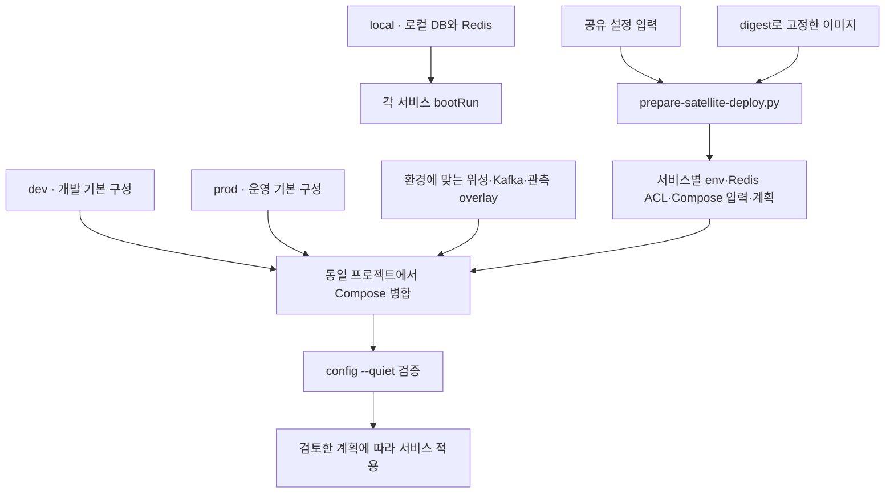

# 서버 실행 · 배포 도구

> 환경별 컨테이너 구성과 서비스 분리·데이터 이관 절차를 재현하는 도구 모음입니다.

[서버 전체 보기](../README.md) · [시스템 아키텍처](../../docs/architecture/system-architecture.md) · [관측 스택](../observability/README.md)

## 1. 구성 방식

기본 Compose에 필요한 overlay를 합쳐 실행합니다. overlay는 서비스나 설정을 추가하는 파일이며 단독 실행을 전제로 하지 않습니다. 서비스 이름 `app`은 Data API를 뜻합니다.



Realtime·OSS 관측 overlay는 dev용입니다. 그림의 선택 항목을 모든 환경에 일괄 적용하는 구조는 아닙니다.

## 2. Compose 파일 안내

| 파일 | 용도 · 전제 |
| --- | --- |
| [local](docker-compose.local.yml) | 로컬 PostgreSQL 16·Redis 7. API는 호스트에서 실행 |
| [dev](docker-compose.dev.yml) | 개발 환경의 Data·DB·Redis 기본 구성 |
| [prod](docker-compose.prod.yml) | 운영 Data·Datadog 구성. DB는 외부 RDS |
| [realtime](docker-compose.realtime.yml) | dev에 채팅 DB 준비 작업·Realtime 추가 |
| [business](docker-compose.business.yml) | Business와 미리보기 전용 Redis 추가 |
| [satellites](docker-compose.satellites.yml) | Business·Notification·전용 Redis. 서비스별 env와 이미지 digest 필수 |
| [satellites.data](docker-compose.satellites.data.yml) | 기존 Data의 env·이미지 교체. `!override` 지원 Compose 필요 |
| [kafka](docker-compose.kafka.yml) | 위성 이벤트 전달용 Kafka |
| [observability](docker-compose.observability.yml) | dev에 Prometheus·Grafana·Loki·exporter 추가 |
| [datadog](docker-compose.datadog.yml) | dev에 Datadog 관측 설정 추가 |

## 3. 자주 쓰는 명령

모든 예시는 **저장소 루트 기준**입니다.

### 로컬 의존성

```bash
docker compose -f server/scripts/docker-compose.local.yml up -d db redis
docker compose -f server/scripts/docker-compose.local.yml ps
```

### 기존 dev에 Realtime 추가

아래 예시는 기존 dev가 `phone` 프로젝트와 `../.gromo-runtime/dev.env`를 사용하는 경우입니다. 실제 배포의 프로젝트명·env 경로가 다르면 동일한 값으로 맞춥니다. `REALTIME_IMAGE`로 사용할 이미지를 지정할 수 있습니다.

```bash
docker compose -p phone --env-file ../.gromo-runtime/dev.env   -f server/scripts/docker-compose.dev.yml   -f server/scripts/docker-compose.realtime.yml config --quiet

docker compose -p phone --env-file ../.gromo-runtime/dev.env   -f server/scripts/docker-compose.dev.yml   -f server/scripts/docker-compose.realtime.yml up -d realtime
```

Compose가 DB·Redis 및 `realtime-db-init` 의존성을 함께 처리합니다. 기존 `chat` 이름의 서비스는 자동으로 중지되지 않으므로 인스턴스 전환 절차에서 확인합니다.

## 4. 위성 배포 준비

[`prepare-satellite-deploy.py`](prepare-satellite-deploy.py)는 공유 SecretString JSON을 표준입력으로 받고 서비스별 허용목록에 맞는 env, Business Redis ACL, Compose 보간 입력과 적용·복구 계획을 생성합니다. 이미지가 `REPOSITORY@sha256:<64hex>` 형식인지 검사합니다.

```bash
python3 server/scripts/prepare-satellite-deploy.py --help
```

| 주요 인자 | 의미 |
| --- | --- |
| `--environment dev\|prod` | 대상 환경 |
| `--phase transition\|final` | 전환 단계, 기본 transition |
| `--output-dir` | 생성 파일 디렉터리 |
| `--base-compose`, `--shared-env-file` | 기존 배포 구성·런타임 설정 |
| `--business-image`, `--notification-image` | 위성 이미지 digest |
| `--data-image`, `--data-profiles` | Data 교체를 준비할 때 사용 |
| `--project-name` | 기존 Compose 프로젝트명 |

이 도구의 결과는 **준비된 파일과 계획**입니다. Compose 실행, Secrets Manager 조회, nginx 재적재, 발송 게이트 활성화는 수행하지 않습니다. 실제 적용 명령은 생성된 계획에서 확인합니다.

위성 라우팅의 참고 설정은 [nginx 경로](nginx-satellites.include.conf.example), [프록시 헤더](nginx-satellites-proxy-headers.conf.example)에 있습니다.

## 5. DB 준비와 데이터 이관

### 알림 DB와 계정

[`provision-notification-db.sh`](provision-notification-db.sh)는 [SQL](provision-notification-db.sql)을 실행해 알림 database와 전용 계정을 준비합니다. 관리자 연결에는 `PGHOST`, `PGUSER`와 libpq 인증 설정을 사용하며 다음 값이 필요합니다.

- `API_DB_USERNAME`, `CORE_DB_NAME`: 기존 Data 계정·database.
- `NOTI_DB_USERNAME`, `NOTI_DB_PASSWORD`: 알림 전용 계정.

실행 전 대상 DB를 확인하고 서비스 환경변수 분리 절차와 함께 적용합니다.

### 링크·클릭 이관

[`migrate-link.py`](migrate-link.py)는 Data의 정지 스냅샷을 별도 Link 서비스로 이관합니다.


```bash
python3 server/scripts/migrate-link.py --help
```

단계마다 `--data-url`, `--link-url`, `--migration-id`를 지정합니다. 자격은 `BATCH_ADMIN_KEY`, `LINK_MIGRATION_TOKEN` 환경변수로 전달합니다. `freeze`에는 실제 구 경로 정지·요청 소진 후 `--source-drained`를 명시합니다. 실패 시 같은 migration ID로 재개합니다.

## 6. 실행 전후 확인

- 병합 검증은 실제 적용과 동일한 `-p`, `--env-file`, `-f` 목록에 `config --quiet`를 사용합니다.
- Data의 서비스별 env 교체는 `app` 재생성을 수반합니다. 생성 계획의 적용·복구 순서를 따릅니다.
- 관측 스택만 멈출 때는 [관측 README의 stop 명령](../observability/README.md)을 사용합니다. 병합 구성의 `down`은 기본 앱·DB까지 내립니다.
- 관리 포트 `9091`은 내부 수집용이며 호스트에 공개하지 않습니다.
- 배포 준비·DB 권한·이관 회귀 검증 코드는 [`.github/scripts`](../../.github/scripts)에 있습니다.
