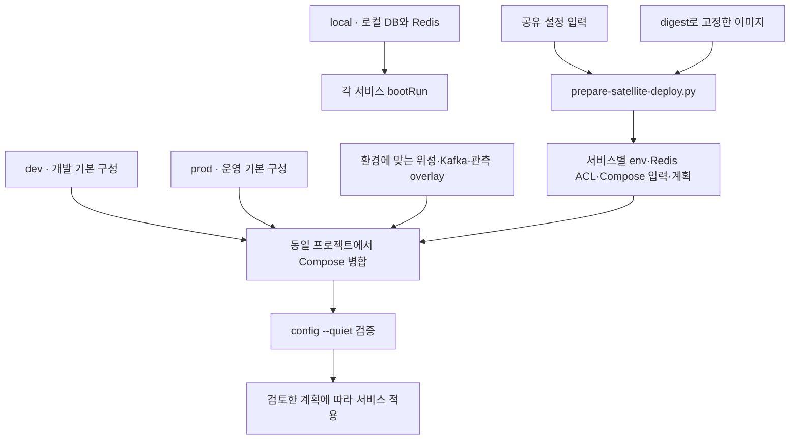

# 서버 실행 · 배포 도구

> 환경별 컨테이너 구성과 서비스 분리·데이터 이관 절차를 재현하는 도구 모음입니다.

[서버 전체 보기](../README.md) · [시스템 아키텍처](../../docs/architecture/system-architecture.md) · [관측 스택](../observability/README.md)

## 1. 구성 방식

기본 Compose에 필요한 overlay를 합쳐 실행합니다. overlay는 서비스나 설정을 추가하는 파일이며 단독 실행을 전제로 하지 않습니다. 서비스 이름 `app`은 Data API를 뜻합니다.



Realtime·OSS 관측 overlay는 dev용입니다. 그림의 선택 항목을 모든 환경에 일괄 적용하는 구조는 아닙니다.

## 2. Compose 파일 안내

| 파일 | 용도 · 전제 |
| --- | --- |
| [local](docker-compose.local.yml) | 로컬 PostgreSQL 16·Redis 7. API는 호스트에서 실행 |
| [dev](docker-compose.dev.yml) | 개발 환경의 Data·DB·Redis 기본 구성 |
| [prod](docker-compose.prod.yml) | 운영 Data·Datadog 구성. DB는 외부 RDS |
| [realtime](docker-compose.realtime.yml) | dev에 채팅 DB 준비 작업·Realtime 추가 |
| [business](docker-compose.business.yml) | Business와 미리보기 전용 Redis 추가 |
| [satellites](docker-compose.satellites.yml) | Business·Notification·전용 Redis. 서비스별 env와 이미지 digest 필수 |
| [satellites.data](docker-compose.satellites.data.yml) | 기존 Data의 env·이미지 교체. `!override` 지원 Compose 필요 |
| [kafka](docker-compose.kafka.yml) | 위성 이벤트 전달용 Kafka |
| [observability](docker-compose.observability.yml) | dev에 Prometheus·Grafana·Loki·exporter 추가 |
| [datadog](docker-compose.datadog.yml) | dev에 Datadog 관측 설정 추가 |

## 3. 환경별 실행 조합

환경마다 **한 줄**입니다. 저장소 루트 기준이고 실제 적용 전에는 같은 인자에 `config --quiet`를 먼저 붙여 봅니다. `<out>`은 [위성 배포 준비](#8-위성-배포-준비)가 만든 출력 디렉터리(서비스별 env·`compose.env`·Business Redis ACL)입니다.

```bash
# local — DB·Redis만 컨테이너. API 는 각 서비스 bootRun
docker compose -f server/scripts/docker-compose.local.yml up -d db redis

# dev (GCP gromo-dev-app) — Data·Postgres·공유 Redis·Realtime·Kafka·Business(+전용 Redis)·Notification. nginx 없음
docker compose -p phone --env-file ../.gromo-runtime/dev.env --env-file <out>/compose.env -f server/scripts/docker-compose.dev.yml -f server/scripts/docker-compose.realtime.yml -f server/scripts/docker-compose.kafka.yml -f server/scripts/docker-compose.satellites.yml -f server/scripts/docker-compose.satellites.data.yml up -d

# prod (AWS gromo-prod) — nginx·Data·datadog-agent·Kafka·Business(+전용 Redis)·Notification. DB 는 RDS, Realtime 없음
docker compose -p "$PROD_PROJECT" --env-file .env.prod --env-file <out>/compose.env -f docker-compose.prod.yml -f docker-compose.kafka.yml -f docker-compose.satellites.yml -f docker-compose.satellites.data.yml up -d
```

| 환경 | 파일 조합 | 지금 자동으로 도는 부분 | 사람이 붙이는 부분 |
| --- | --- | --- | --- |
| local | local | — | 전부 |
| dev | dev (+datadog) (+kafka) (+satellites.data) → + realtime · satellites | `dev-cd.yml`: `dev.yml` + 이미 떠 있는 datadog·kafka·Data 전용 env 를 유지하며 `up -d app`만 | Realtime(`up -d realtime`) · 위성(준비 도구의 계획) · Kafka 기동(Actions **Dev Kafka**) |
| prod | prod (+kafka) (+satellites (+satellites.data)) | `prod-cd.yml` → SSM 문서가 `docker-compose.prod.yml` 단독 `up -d` | 위성·Kafka 전부 수동. Realtime 은 prod 배선 자체가 없다 |

- `satellites.data.yml`은 **마지막 `-f`** 여야 하고 Data 전용 env 가 있을 때만 붙입니다. 없으면 빼면 Data 는 legacy env 로 뜹니다.
- prod 파일에는 `name:`이 없어 프로젝트명이 호스트 디렉터리에서 정해집니다. `satellites.yml`의 `name: phone`이 이를 바꾸지 않도록 `-p`에 `docker compose ls`로 확인한 현재 이름을 넣습니다.
- `docker-compose.business.yml`은 Notification 없이 Business 만 띄우는 옛 진입점입니다. `satellites.yml`과 **함께 쓰지 않습니다**(같은 서비스를 정의).
- dev 관측은 위 줄에 `-f server/scripts/docker-compose.datadog.yml` 또는 `-f server/scripts/docker-compose.observability.yml`을 더합니다.

## 4. 시크릿·스위치 — 비었을 때의 동작

dev 의 `../.gromo-runtime/dev.env`는 `dev-cd.yml`이 **매 배포마다** Secrets Manager `gromo/dev/env`에서 다시 씁니다([`write-compose-env.py`](../../.github/scripts/write-compose-env.py) legacy). 그래서 dev 스위치는 파일이 아니라 **SM 키**로 바꿉니다. 필수 9개 외 아래 dev 행의 키는 SM 에 있을 때만 옮기고, 없으면 compose 기본값이 남습니다. 위성·Data 전용 env 는 같은 스크립트의 `--service` 허용목록이 정합니다. prod 의 Data 는 `.env.prod`(SM `gromo/prod/env` 전체)를 통째로 받습니다.

| 키 | 받는 쪽 · 경로 | 비었을 때 |
| --- | --- | --- |
| `SVC_TOKEN_DATA_TO_REALTIME` | Realtime(dev.env → `realtime.yml`) · Data(satellites 프로파일, `data-api.env` 선택) | Realtime `POST /internal/events` 가 401 → Data relay 의 REALTIME 행이 전달되지 않고 재시도로 남는다. Data 는 relay OFF 면 무영향, relay ON 이면 기동 거부 |
| `REALTIME_BASE_URL` | Business(`business-api.env` **필수**) · Data(satellites, 선택) | Business: writer 가 env 생성 단계에서 거부(수동 누락 시 부팅 fail-fast). Data: relay ON 이면 기동 거부 |
| `SVC_TOKEN_BIZ_TO_REALTIME` | Business(**필수**) · Realtime(dev.env → `realtime.yml`) | Realtime 쪽이 비면 우체통 내부 어댑터 `/internal/*` 401 → 섬 편지 저장 실패 |
| `BUSINESS_CURSOR_ENABLED` · `BUSINESS_CURSOR_KEY_V1` | Business(**필수**) | writer 가 거부. 손으로 비우면 부팅·헬스는 정상인데 `GET /islands`·`/islands/discover` 만 503 |
| `BUSINESS_CURSOR_ACTIVE_KEY` | Business(선택) | `v1` |
| `LOGIN_ATTEMPT_DIGEST_SECRET` | Business(**필수**) | writer 가 거부(부팅 fail-fast) |
| `OUTBOX_RELAY_REALTIME_KAFKA_ENABLED` | Data(satellites, 선택) | `false` — REALTIME 을 HTTP 로 보낸다 |
| `REALTIME_EVENTS_KAFKA_ENABLED` | Realtime(dev.env) | `false` — `realtime-events` 소비자가 뜨지 않는다 |
| `KAFKA_BOOTSTRAP_SERVERS` | Realtime(dev.env) · Data·Notification(서비스 env) | Realtime·Data 는 `kafka:9092`. Notification 은 필수 |
| `FOCUS_SESSION_START_ENABLED` | Data(dev.env → `dev.yml`, `data-api.env` 선택) | `false` — 새 집중 start 만 503 |
| `FOCUS_PRESENCE_ENABLED` | Data(같은 경로) | `false` — 프레즌스를 쓰지 않는다 |

켜는 순서는 [runtime.md «dev 에서 켜는 순서»](../../docs/prd/fishcat/server-separation/runtime.md#dev-에서-켜는-순서)가 정본입니다. `REALTIME_AUTHORIZATION_*`·`SVC_TOKEN_REALTIME_TO_DATA`(기본 OFF 인 채팅 멤버십 인가)는 아직 compose 에 배선하지 않았습니다.

## 5. 컨테이너 로그 보존

모든 서비스에 `json-file` 크기 회전을 둡니다. 정본은 [계정 정책 L09](../../docs/prd/fishcat/account/policy.md#로그분석-보존-기간)입니다.

| 묶음 | 서비스 | 값 | 상한 |
| --- | --- | --- | --- |
| 앱 로그 | Data·Realtime·Business·Notification·prod nginx | `max-size 50m` · `max-file 4` | 컨테이너당 200 MB |
| 인프라 | Postgres·Redis·Kafka·datadog-agent·관측 스택·일회성 잡 | `max-size 10m` · `max-file 3` | 컨테이너당 30 MB |

- JVM 서비스의 stdout 은 logback APP 로그(L01, **7일**)와 같은 내용이므로 목표는 7일입니다. Docker 는 **기간이 아니라 크기로만** 지우므로 200 MB 는 「하루 약 30 MB 이하」를 가정한 근사치입니다. 로그가 더 적으면 7일보다 오래 남고, 많으면 일찍 지워집니다.
- 실측 후 보정합니다. 하루 뒤 `sudo du -h $(docker inspect -f '{{.LogPath}}' <컨테이너>)*`로 일 증가량을 재고 `max-size × max-file ≈ 7 × 일 증가량`이 되도록 이 파일들의 앵커 한 줄을 고칩니다.
- `logging`이 바뀐 컨테이너는 다음 `up`에서 **재생성**됩니다. dev 는 CD 의 `up -d app`이 의존성 `db`까지 한 번 재생성합니다(짧은 DB 재기동). `redis`는 app 의존성이 아니라 사람이 `up -d redis`를 할 때 적용됩니다. prod 는 SSM 의 `up -d`가 nginx·agent 까지 재생성합니다.

## 6. Business Redis ACL 반영

Redis 는 `--aclfile`을 **기동 때만** 읽습니다. `default` 사용자를 꺼 두어 `ACL LOAD`를 부를 수 있는 사용자도 없습니다. `BUSINESS_REDIS_PASSWORD`를 바꿔 ACL 파일을 다시 만들었다면 위성보다 먼저 재생성합니다(준비 도구의 계획 2단계).

```bash
docker compose <위 환경 줄의 -p·--env-file·-f 그대로> up -d --force-recreate business-redis
```

ACL 파일은 원자 교체(새 inode)라 `restart`만으로는 기존 단일 파일 바인드가 옛 내용을 볼 수 있습니다. 캐시 전용(저장 없음)이라 재생성으로 비워져도 다시 채워집니다.

## 7. 자주 쓰는 명령

모든 예시는 **저장소 루트 기준**입니다.

### 로컬 의존성

```bash
docker compose -f server/scripts/docker-compose.local.yml up -d db redis
docker compose -f server/scripts/docker-compose.local.yml ps
```

### 기존 dev에 Realtime 추가

아래 예시는 기존 dev가 `phone` 프로젝트와 `../.gromo-runtime/dev.env`를 사용하는 경우입니다. 실제 배포의 프로젝트명·env 경로가 다르면 동일한 값으로 맞춥니다. `REALTIME_IMAGE`로 사용할 이미지를 지정할 수 있습니다.

```bash
docker compose -p phone --env-file ../.gromo-runtime/dev.env   -f server/scripts/docker-compose.dev.yml   -f server/scripts/docker-compose.realtime.yml config --quiet

docker compose -p phone --env-file ../.gromo-runtime/dev.env   -f server/scripts/docker-compose.dev.yml   -f server/scripts/docker-compose.realtime.yml up -d realtime
```

Compose가 DB·Redis 및 `realtime-db-init` 의존성을 함께 처리합니다. 기존 `chat` 이름의 서비스는 자동으로 중지되지 않으므로 인스턴스 전환 절차에서 확인합니다.

## 8. 위성 배포 준비

[`prepare-satellite-deploy.py`](prepare-satellite-deploy.py)는 공유 SecretString JSON을 표준입력으로 받고 서비스별 허용목록에 맞는 env, Business Redis ACL, Compose 보간 입력과 적용·복구 계획을 생성합니다. 이미지가 `REPOSITORY@sha256:<64hex>` 형식인지 검사합니다.

```bash
python3 server/scripts/prepare-satellite-deploy.py --help
```

| 주요 인자 | 의미 |
| --- | --- |
| `--environment dev\|prod` | 대상 환경 |
| `--phase transition\|final` | 전환 단계, 기본 transition |
| `--output-dir` | 생성 파일 디렉터리 |
| `--base-compose`, `--shared-env-file` | 기존 배포 구성·런타임 설정 |
| `--business-image`, `--notification-image` | 위성 이미지 digest |
| `--data-image`, `--data-profiles` | Data 교체를 준비할 때 사용 |
| `--project-name` | 기존 Compose 프로젝트명 |

이 도구의 결과는 **준비된 파일과 계획**입니다. Compose 실행, Secrets Manager 조회, nginx 재적재, 발송 게이트 활성화는 수행하지 않습니다. 실제 적용 명령은 생성된 계획에서 확인합니다.

위성 라우팅의 참고 설정은 [nginx 경로](nginx-satellites.include.conf.example), [프록시 헤더](nginx-satellites-proxy-headers.conf.example)에 있습니다.

## 9. DB 준비와 데이터 이관

### 알림 DB와 계정

[`provision-notification-db.sh`](provision-notification-db.sh)는 [SQL](provision-notification-db.sql)을 실행해 알림 database와 전용 계정을 준비합니다. 관리자 연결에는 `PGHOST`, `PGUSER`와 libpq 인증 설정을 사용하며 다음 값이 필요합니다.

- `API_DB_USERNAME`, `CORE_DB_NAME`: 기존 Data 계정·database.
- `NOTI_DB_USERNAME`, `NOTI_DB_PASSWORD`: 알림 전용 계정.

실행 전 대상 DB를 확인하고 서비스 환경변수 분리 절차와 함께 적용합니다.

### 링크·클릭 이관

[`migrate-link.py`](migrate-link.py)는 Data의 정지 스냅샷을 별도 Link 서비스로 이관합니다.


```bash
python3 server/scripts/migrate-link.py --help
```

단계마다 `--data-url`, `--link-url`, `--migration-id`를 지정합니다. 자격은 `BATCH_ADMIN_KEY`, `LINK_MIGRATION_TOKEN` 환경변수로 전달합니다. `freeze`에는 실제 구 경로 정지·요청 소진 후 `--source-drained`를 명시합니다. 실패 시 같은 migration ID로 재개합니다.

## 10. 로그 S3 적재본 수명 주기

[`s3-log-archive-lifecycle.json`](s3-log-archive-lifecycle.json)은 운영 로그 적재 버킷 `gromo-prod-logs-808715036056`(AWS 프로필 `gromo`)의 만료 규칙입니다. 접두 세 개 모두 **90일**입니다.

| 접두 | 내용 | 적재 경로 |
| --- | --- | --- |
| `system_log/app-N/` | `app.log` | 호스트 systemd 타이머가 매시간 업로드(티켓 590) |
| `user_log/app-N/` | `user-activity.log` | 같은 타이머(티켓 590) |
| `user-activity/dt=YYYY-MM-DD/` | user-activity 로그 | Fluent Bit 전환 예정 접두(티켓 790, 미완) |

로컬 logback 보존(APP 7일·user-activity 30일)과 S3 보존은 **다른 값**입니다. 기간 정본은 [계정 정책 로그·분석 보존 기간](../../docs/prd/fishcat/account/policy.md#로그분석-보존-기간)이며 S3 값을 바꾸면 이 파일과 정책 표를 함께 고칩니다.

**적용 완료 2026-09-19** — 이 파일은 버킷에 적용된 규칙의 기록입니다. 버킷의 Terraform 원본(`docs/terraform/aws-prod-server/s3.tf`, 티켓 590)은 이 레포 밖에 있어 **동기화가 필요**합니다. 동기화 전에 Terraform을 적용하면 이 규칙이 덮어써질 수 있습니다.

`put-bucket-lifecycle-configuration`은 버킷의 기존 규칙 전체를 **교체**합니다. 먼저 현재 규칙을 조회해 다른 규칙이 있으면 이 파일에 합친 뒤 적용합니다.

```bash
aws --profile gromo s3api get-bucket-lifecycle-configuration --bucket gromo-prod-logs-808715036056
aws --profile gromo s3api put-bucket-lifecycle-configuration --bucket gromo-prod-logs-808715036056 \
  --lifecycle-configuration file://server/scripts/s3-log-archive-lifecycle.json
aws --profile gromo s3api get-bucket-lifecycle-configuration --bucket gromo-prod-logs-808715036056
```

## 11. 실행 전후 확인

- 병합 검증은 실제 적용과 동일한 `-p`, `--env-file`, `-f` 목록에 `config --quiet`를 사용합니다.
- Data의 서비스별 env 교체는 `app` 재생성을 수반합니다. 생성 계획의 적용·복구 순서를 따릅니다.
- 관측 스택만 멈출 때는 [관측 README의 stop 명령](../observability/README.md)을 사용합니다. 병합 구성의 `down`은 기본 앱·DB까지 내립니다.
- 관리 포트 `9091`은 내부 수집용이며 호스트에 공개하지 않습니다.
- 배포 준비·DB 권한·이관 회귀 검증 코드는 [`.github/scripts`](../../.github/scripts)에 있습니다.
