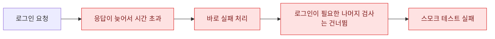
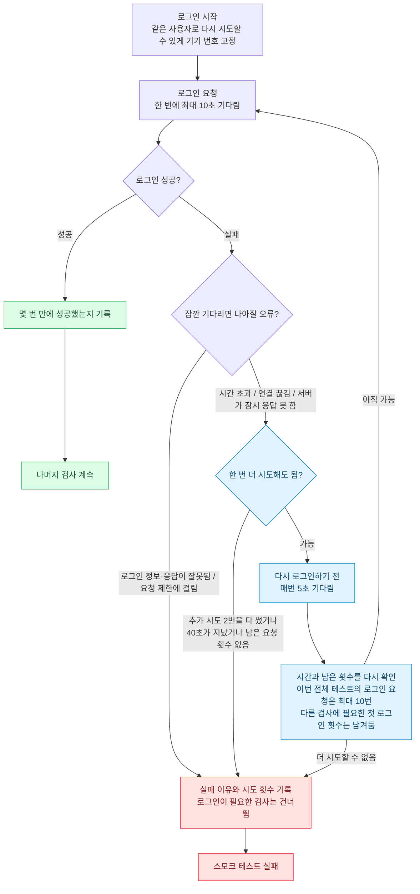

# 스모크 테스트: 로그인이 늦을 때

[GROMO-2543](https://romance.atlassian.net/browse/GROMO-2543) · [전체 실행 흐름](../README.md#전체-실행-흐름) · [실행 방법](README.md) · [TC 명세](TCL.md)

## AS IS

```mermaid
flowchart LR
    A["로그인 요청"] --> B["응답이 늦어서 시간 초과"]
    B --> C["바로 실패 처리"]
    C --> D["로그인이 필요한 나머지 검사는 건너뜀"]
    D --> E["스모크 테스트 실패"]
    classDef bad fill:#fee2e2,stroke:#dc2626,color:#7f1d1d;
    class B,C,D,E bad;
```

## TO BE

```mermaid
flowchart TD
    A["로그인 시작<br/>같은 사용자로 다시 시도할 수 있게 기기 번호 고정"] --> B["로그인 요청<br/>한 번에 최대 10초 기다림"]
    B --> C{"로그인 성공?"}
    C -->|"성공"| D["몇 번 만에 성공했는지 기록"]
    D --> E["나머지 검사 계속"]
    C -->|"실패"| F{"잠깐 기다리면 나아질 오류?"}
    F -->|"로그인 정보·응답이 잘못됨 / 요청 제한에 걸림"| X["실패 이유와 시도 횟수 기록<br/>로그인이 필요한 검사는 건너뜀"]
    F -->|"시간 초과 / 연결 끊김 / 서버가 잠시 응답 못 함"| G{"한 번 더 시도해도 됨?"}
    G -->|"추가 시도 2번을 다 썼거나<br/>40초가 지났거나 남은 요청 횟수 없음"| X
    G -->|"가능"| H["다시 로그인하기 전<br/>매번 5초 기다림"]
    H --> I["시간과 남은 횟수를 다시 확인<br/>이번 전체 테스트의 로그인 요청은 최대 10번<br/>다른 검사에 필요한 첫 로그인 횟수는 남겨둠"]
    I -->|"아직 가능"| B
    I -->|"더 시도할 수 없음"| X
    X --> Y["스모크 테스트 실패"]
    classDef good fill:#dcfce7,stroke:#16a34a,color:#14532d;
    classDef retry fill:#e0f2fe,stroke:#0284c7,color:#0c4a6e;
    classDef bad fill:#fee2e2,stroke:#dc2626,color:#7f1d1d;
    class D,E good;
    class G,H,I retry;
    class X,Y bad;
```
